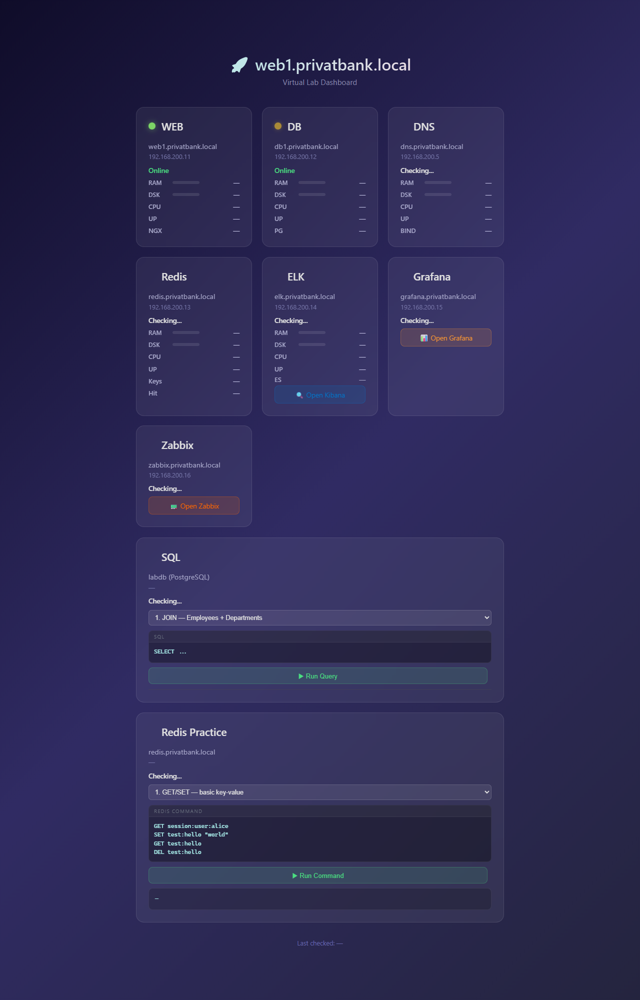

# Vagrant Lab — Practice Environment

Сім віртуальних машин для демонстрації навичок роботи з базами даних (SQL/NoSQL),
системами моніторингу (Zabbix, Grafana, ELK) та DevOps інструментами.

| VM | IP | Роль | Технології |
|----|----|------|------------|
| `dns` | 192.168.200.5 | DNS-сервер | BIND, Oracle Linux 10 |
| `web1` | 192.168.200.11 | Веб-сервер | nginx, dashboard, metrics, reverse proxy |
| `db1` | 192.168.200.12 | PostgreSQL | SQL (labdb), health/metrics API |
| `redis` | 192.168.200.13 | NoSQL | Redis (sessions, cache, rate-limiting, leaderboard) |
| `elk` | 192.168.200.14 | Логування | Elasticsearch + Kibana + Filebeat |
| `grafana` | 192.168.200.15 | BI/Monitoring | Grafana (дашборди з PostgreSQL) |
| `zabbix` | 192.168.200.16 | Monitoring | Zabbix server + frontend + agent |

---

## Структура

```
vagrant-lab-practice/
├── Vagrantfile              # 7 VMs (dns, web1, db1, redis, elk, grafana, zabbix)
├── .gitattributes           # LF line endings for text files
├── lib/
│   └── secrets.rb           # Auto-generates password files (idempotent)
├── web/                     # Dashboard (HTML/CSS/JS)
│   ├── index.html           # 9 cards: 7 metrics + SQL + Redis Practice
│   ├── style.css            # Dark theme
│   └── script.js            # Polling health + metrics (10s interval)
├── scripts/
│   ├── setup-bind.sh        # BIND DNS + metrics-dns daemon
│   ├── setup-dns.sh         # DNS client (resolvectl) for all VMs
│   ├── setup-nginx.sh       # nginx + SSL + reverse proxy config
│   ├── setup-web-metrics.sh # Web metrics daemon (CPU/RAM/disk/inodes/nginx stats)
│   ├── setup-postgres.sh    # PostgreSQL (labdb, labuser) + health/metrics daemons
│   ├── setup-sql-practice.sh # labdb (5 tables, indexes, queries) + SQL API
│   ├── setup-redis.sh       # Redis + seed data + health API + practice API
│   ├── setup-elk.sh         # Elasticsearch 8.17.3 + Kibana
│   ├── setup-filebeat.sh    # Filebeat log collector (every VM)
│   ├── setup-grafana.sh     # Grafana + PostgreSQL datasources + dashboard
│   ├── setup-zabbix.sh      # Zabbix 7.0 LTS server + frontend + agent
│   ├── install-uv.sh        # Installs uv (Python package manager)
│   └── seed-sql-data.{sh,py} # Faker-based data seeding for labdb
└── secrets/                 # *.gitignore — auto-generated by lib/secrets.rb
    ├── pg_password.txt
    ├── grafana_password.txt
    └── redis_password.txt
```

---

## Quick Start

```bash
# Start all VMs (passwords auto-generate on first run via lib/secrets.rb)
vagrant up

# Open dashboard
# https://web1.privatbank.local
```

**Hosts file** (`C:\Windows\System32\drivers\etc\hosts`):

```
192.168.200.5  dns.privatbank.local
192.168.200.11 web1.privatbank.local
192.168.200.12 db1.privatbank.local
192.168.200.13 redis.privatbank.local
192.168.200.14 elk.privatbank.local
192.168.200.15 grafana.privatbank.local
192.168.200.16 zabbix.privatbank.local
```

**Passwords:** stored in `secrets/*.txt`, auto-generated on first `vagrant up`.
To view: `cat secrets/pg_password.txt`



---

## Dashboard

`https://web1.privatbank.local` — 9 cards in two groups:

**Small metric cards** (system health):
- WEB, DB, DNS, Redis, ELK, Grafana, Zabbix — RAM/DSK/CPU/uptime + service-specific metrics
- All show inode usage on disk row (`· inodes X%`)

**Full-width query cards:**
- **SQL** — 10 predefined queries (JOIN, GROUP BY, CTE, window functions, EXPLAIN) + custom SQL input
- **Redis Practice** — 10 predefined command blocks (GET/SET, hashes, lists, sets, sorted sets, intro, expiry, counters) + custom command input

---

## Reverse Proxy

All internal services proxied through nginx on web1 (same-origin, no mixed content).

| URL | Upstream |
|-----|----------|
| `/api/health/db` | `192.168.200.12:8080` |
| `/api/health/db-metrics` | `192.168.200.12:8081` |
| `/api/health/web-metrics` | `127.0.0.1:8082` |
| `/api/health/dns-metrics` | `192.168.200.5:8083` |
| `/api/health/elk-metrics` | `192.168.200.14:8083` |
| `/api/sql-practice/` | `192.168.200.12:8082` |
| `/api/redis/` | `192.168.200.13:8080` |
| `/api/redis-practice/` | `192.168.200.13:8085` |
| `/api/kibana/` | `192.168.200.14:5601` |
| `/api/grafana/` | `192.168.200.15:3000` |
| `/api/zabbix/` | `192.168.200.16/zabbix` |

---

## Що демонструє кожен компонент

### SQL (db1 / labdb)

5 таблиць: `departments`, `employees`, `products`, `orders`, `order_items`.

10 reference queries: JOIN, GROUP BY, subquery, CTE, window functions (RANK, running total),
LEFT JOIN, EXPLAIN ANALYZE. Custom SQL via textarea (SELECT/WITH/EXPLAIN only).

**API:** `https://web1.privatbank.local/api/sql-practice/query/0..9`

### NoSQL (redis)

Redis з різними типами даних (strings, hashes, lists, sets, sorted sets) + rate-limiting, EXPIRE.

**API:** `https://web1.privatbank.local/api/redis/`

### Redis Practice (redis:8085)

10 predefined command blocks, multi-line execution, custom command input. Dangerous commands blocked (FLUSHALL, CONFIG, SHUTDOWN, etc.).

**API:** `https://web1.privatbank.local/api/redis-practice/command/0..9`

### ELK (elk)

- Elasticsearch 8.17.3 — зберігання та пошук логів
- Kibana — візуалізація
- Filebeat на 6 VMs — збір системних логів

### Grafana (grafana)

- PostgreSQL datasource (`labdb`)
- 6-panel dashboard (DB connections, database size, budget, employees, salary, orders)
- Anonymous access (Viewer role)

### Zabbix (zabbix)

- Zabbix Server 7.0 LTS — централізований моніторинг
- PostgreSQL backend (локальний)
- Agent2 для самоконтролю
- Веб-фронтенд: Apache + PHP

> **NOTE:** Admin password hardcoded to `zabbix` (set via bcrypt hash with `SQL UPDATE`).  
> Not stored in `secrets/zabbix_password.txt` — that file exists but is ignored by the provisioner.

---

## Debugging

### Basic connectivity

```bash
# Check all VMs are running
vagrant status

# SSH into any VM
vagrant ssh web1

# Check nginx reverse proxy config
vagrant ssh web1 -c "sudo nginx -t"
```

### Service health checks

```bash
# From host, test proxy endpoints via web1
curl -sk https://web1.privatbank.local/api/health/db        # PostgreSQL
curl -sk https://web1.privatbank.local/api/sql-practice/    # SQL API
curl -sk https://web1.privatbank.local/api/redis/           # Redis health
curl -sk https://web1.privatbank.local/api/redis-practice/  # Redis Practice API
curl -sk https://web1.privatbank.local/api/grafana/api/health  # Grafana
curl -sk https://web1.privatbank.local/api/kibana/api/status   # Kibana
curl -sk https://web1.privatbank.local/api/zabbix/             # Zabbix
```

### Check individual services inside VMs

```bash
# nginx (web1)
vagrant ssh web1 -c "systemctl status nginx --no-pager"

# PostgreSQL (db1)
vagrant ssh db1 -c "systemctl status postgresql --no-pager"

# Redis (redis)
vagrant ssh redis -c "systemctl status redis-server --no-pager"

# Elasticsearch (elk)
vagrant ssh elk -c "systemctl status elasticsearch --no-pager"

# Grafana (grafana)
vagrant ssh grafana -c "systemctl status grafana-server --no-pager"

# Zabbix (zabbix)
vagrant ssh zabbix -c "systemctl status zabbix-server --no-pager; systemctl status zabbix-agent2 --no-pager"
```

### Check metrics daemons

```bash
# web1
vagrant ssh web1 -c "systemctl status metrics-web --no-pager"

# db1
vagrant ssh db1 -c "systemctl status health-server metrics-server --no-pager"

# dns
vagrant ssh dns -c "systemctl status metrics-dns --no-pager"

# redis
vagrant ssh redis -c "systemctl status redis-api redis-practice --no-pager"

# elk
vagrant ssh elk -c "systemctl status elk-metrics --no-pager"
```

### PostgreSQL (DBeaver / external client)

| Field | Value |
|-------|-------|
| Host | `192.168.200.12` |
| Port | `5432` |
| Database | `labdb` |
| User | `labuser` |
| Password | `cat secrets/pg_password.txt` |
| SSL | disable (`sslmode=disable`) |

### Vagrant commands

| Command | Action |
|---------|--------|
| `vagrant up` | Start all VMs |
| `vagrant up db1` | Start specific VM |
| `vagrant ssh web1` | SSH to VM |
| `vagrant provision db1` | Re-run provisioning for a VM |
| `vagrant halt` | Stop all VMs |
| `vagrant destroy -f redis && vagrant up redis` | Full re-create a VM |

### Known issues

- **Zabbix systemd status** shows `activating (start)` forever — this is cosmetic (Type=forking + no PID file). Server actually runs.
- **Elasticsearch** generates SSL certs on first start — lab config disables SSL (`xpack.security.*.ssl.enabled: false`).
- **Redis RDB** persistence disabled (`save ""`) — in-memory only for lab stability.
- **Zabbix admin** password hardcoded to `zabbix` (bcrypt hash via SQL UPDATE).
